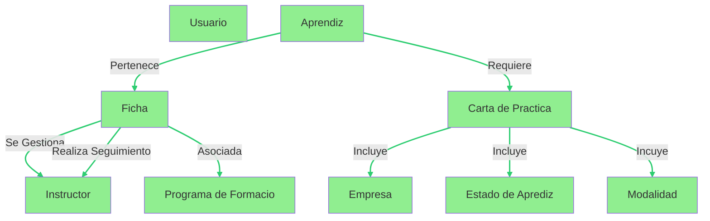

# DISGRAMAS

## - DIAGRAMA DE COMPONENETES

```mermaid
graph TB
    Usuario["Usuario"] 
    Aprendiz["Aprendiz"]
    Ficha["Ficha"]
    Instructor["Instructor"]
    ProgramaFormacion["Programa de Formacio"]
    CartaPractica["Carta de Practica"]
    Empresa["Empresa"]
    EstadoAprediz["Estado de Aprediz"]
    Modalidad["Modalidad"]

    style Usuario fill:lightgreen
    style Aprendiz fill:lightgreen
    style Ficha fill:lightgreen
    style Instructor fill:lightgreen
    style ProgramaFormacion fill:lightgreen
    style CartaPractica fill:lightgreen
    style Empresa fill:lightgreen
    style EstadoAprediz fill:lightgreen
    style Modalidad fill:lightgreen

    Aprendiz --> |Pertenece| Ficha
    Ficha --> |Se Gestiona| Instructor
    Ficha --> |Realiza Seguimiento| Instructor
    Ficha --> |Asociada| ProgramaFormacion
    Aprendiz --> |Requiere| CartaPractica
    CartaPractica --> |Incluye| Empresa
    CartaPractica --> |Incluye| EstadoAprediz
    CartaPractica --> |Incuye| Modalidad

    linkStyle 0 stroke:#2ecd71,stroke-width:2px;
    linkStyle 1 stroke:#2ecd71,stroke-width:2px;
    linkStyle 2 stroke:#2ecd71,stroke-width:2px;
    linkStyle 3 stroke:#2ecd71,stroke-width:2px;
    linkStyle 4 stroke:#2ecd71,stroke-width:2px;
    linkStyle 5 stroke:#2ecd71,stroke-width:2px;
    linkStyle 6 stroke:#2ecd71,stroke-width:2px;
    linkStyle 7 stroke:#2ecd71,stroke-width:2px;
```