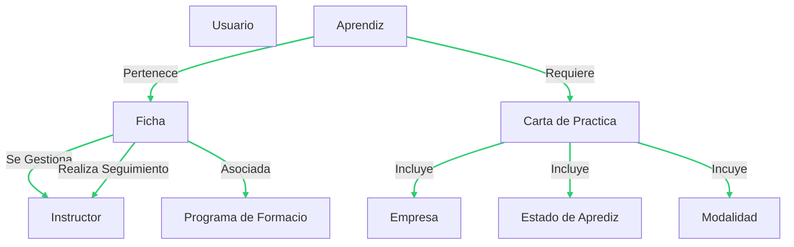
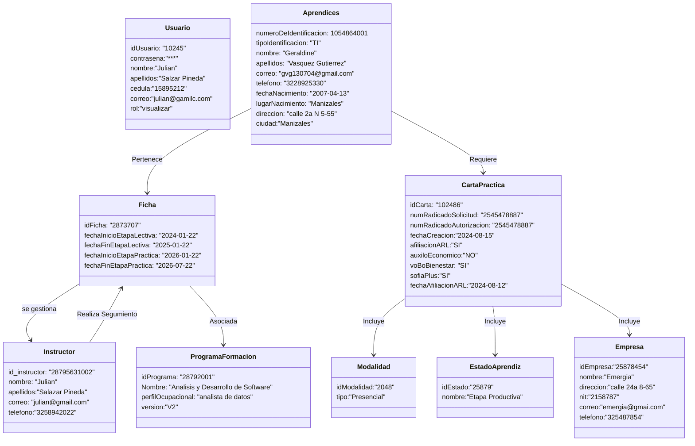
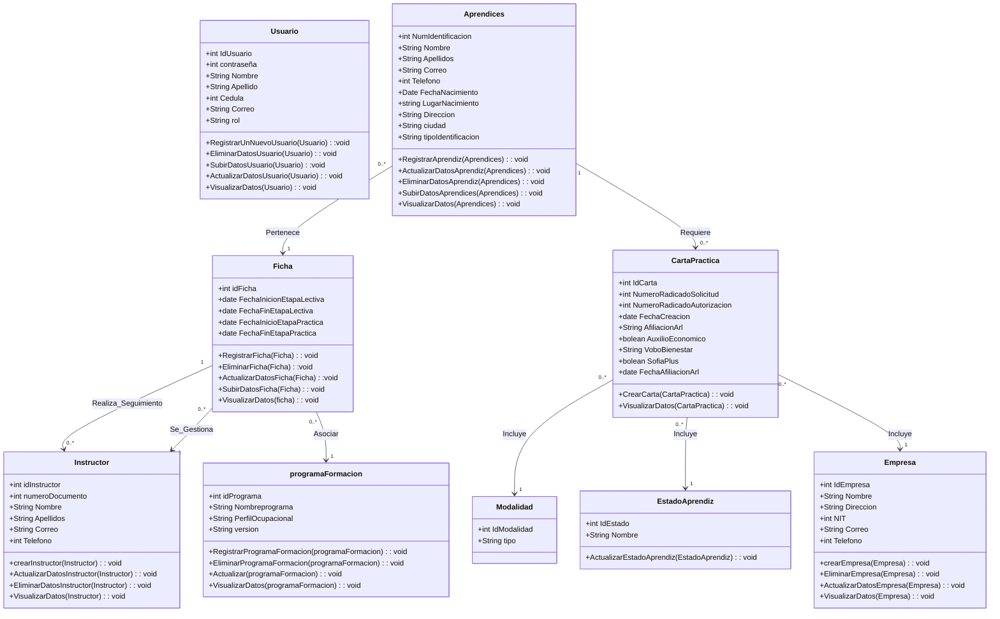
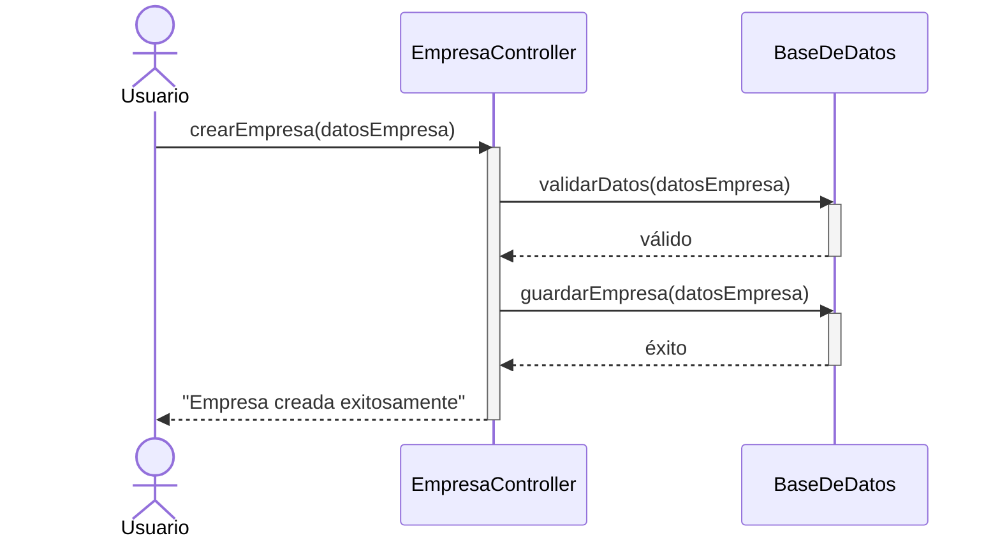

# DIAGRAMAS

## - DIAGRAMA DE COMPONENETES

*en este diagrama vemos que el* **Usuario** *no tiene una relacion directa con los demas componentes, 
solo se maneja los perfiles con sus roles para el ingreso a la app, luego tenemos un flujo donde el* **Aprendiz** 
*pertenece a un ficha la cual esta asociada con un* **Programa de Formacion** *y esta ficha es gestionada por un* **Instructor** *a la vez el aprendiz requere una* **Carta de practica** *que incluye de información* **Empresa, Estado Aprendiz y Modalidad**.

## -DIAGRAMA DE OBJETOS

*en el diagrama de objetos podemos ver el mismo flijo que en el digrama de componentes solo que en este podemos ver al detalle cada uno de los traubitos que tiene cada una de las clases involucradas en es sofware.*

## -DIAGRAMA DE CLASES

*En el diagrama de clases podemos observar adicinalmente todas las* **Funciones (Metodos)** *que se oueden realizar en cada una de las clases como:*  
- *Actualizar*  
- *Eliminar*  
- *Subir datos*  
- *Visualizar datos*

## DIGRAMA DE SECUENCIAS

